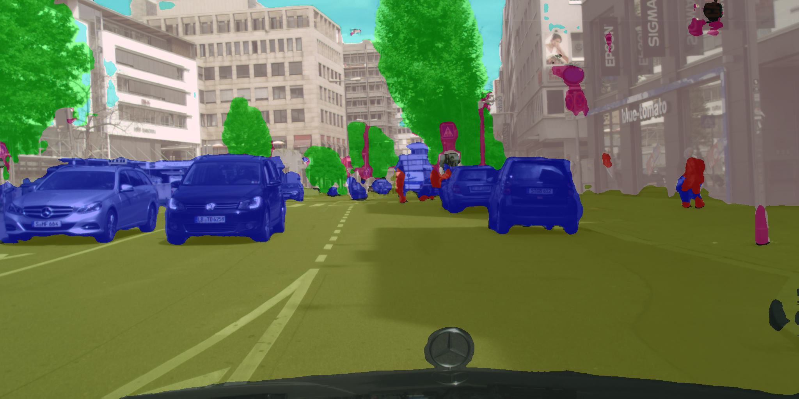
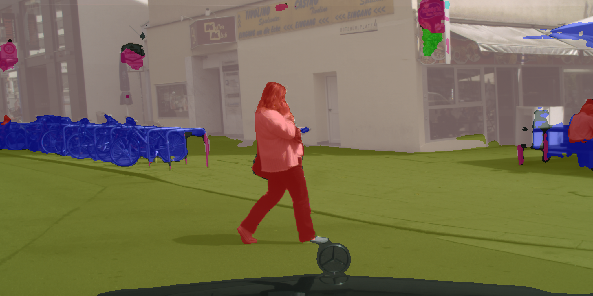
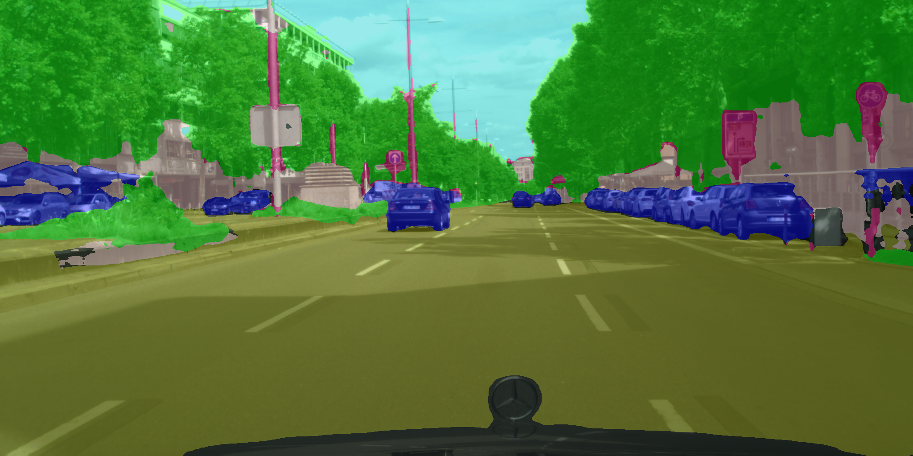

# Readme
The model was trained on cityscape-dataset with classes merged into 8 main classes.
The model was trained for 300k iterations with lr=0.001, and no wd.
Results are expected to improve drastically after hyperparameter tuning
You can download the pretrained weights from here
[Pretrained weights](https://drive.google.com/file/d/1RaRn9eI40ZDXAX-ajnCT0oWJclR8w9RF/view?usp=sharing)
## List of classes
  - void
  - flat
  - construction
  - object
  - nature
  - sky
  - human
  - vehicle

# Results
The following color map has been used to display the results
```
color_map = {
 '0': [0, 0, 0],
 '1': [153, 153, 0],
 '2': [255, 204, 204],
 '3': [255, 0, 127],
 '4': [0, 255, 0],
 '5': [0, 204, 204],
 '6': [255, 0, 0],
 '7': [0, 0, 255]
}
```

## Video results
[Part 1](https://youtu.be/ehy4yoVLuvM)
[Part 2](https://youtu.be/Q7Z_4USTNuU)
[Part 3](https://youtu.be/x5JNB3NrNfY)
[Part 4](https://youtu.be/YwalCv13E0Q)

## Image results




  
## To-do
- [ ] Hyperparameter tuning
- [ ] Extend to cover all the original classes
- [X] Try with Conv2DTranspose
