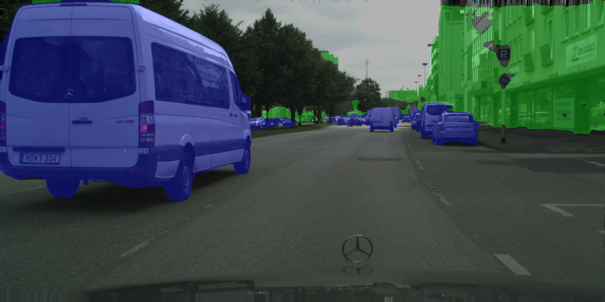
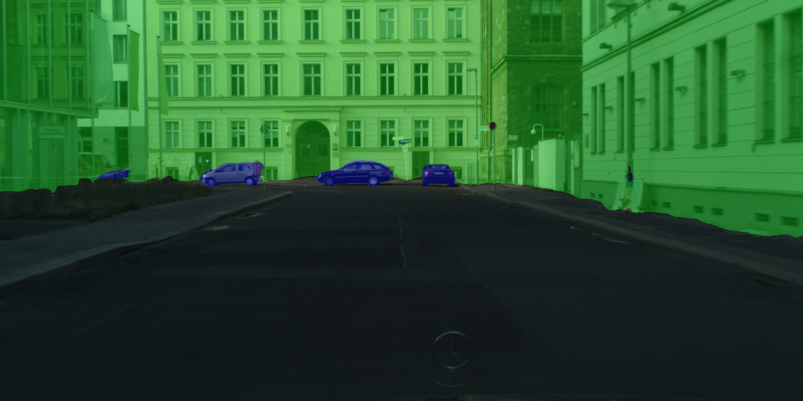
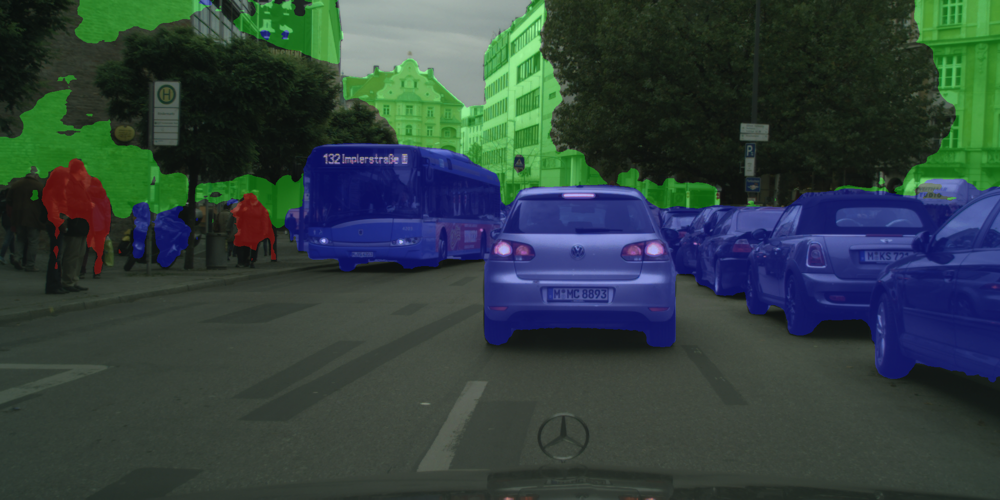
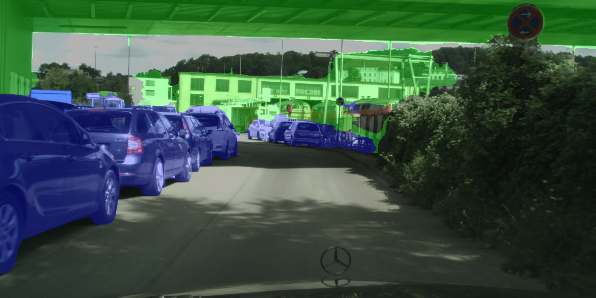

# Readme
The model was trained on cityscape-dataset with classes merged into 8 main classes.
The model was trained for 300k iterations with lr=0.001, and no wd.
Results are expected to improve drastically after hyperparameter tuning

## List of classes
  - void
  - flat
  - construction
  - object
  - nature
  - sky
  - human
  - vehicle

## Results
The results have only 3 classes marked on them. 
 - human (Red)
 - construction (Green)
 - vehicle (Blue)

  
## To-do
- [ ] Hyperparameter tuning
- [ ] Extend to cover all the original classes
- [ ] Try with Conv2DTranspose
